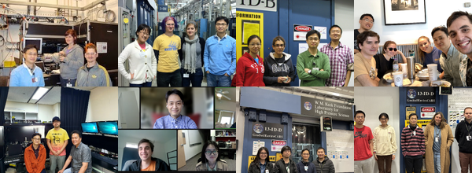

<section class="page-hero profile-hero people-hero">
  

    <h1>{{ site.data.people.hero.title }}</h1>
    

      {{ site.data.people.hero.lead }}
    

    <nav class="section-nav" aria-label="People section">
      <a class="is-active" href="people.html">Overview</a>
      <a href="#current-members">Current members</a>
      <a href="#alumni">Alumni</a>
    </nav>
  

  

    

      
    

  

</section>

<section id="current-members" class="section-block">
  

    

      <h2>Current members</h2>
    

    

      

        
        <article class="card member-card">
          <h3>{{ person.name }}</h3>
          
{{ person.role }}

        </article>
        
      

    

  

</section>

<section id="alumni" class="section-block">
  

    

      <h2>Alumni</h2>
    

    

      
      <article class="subpage-item">
        

          {{ person.name }} ({{ person.years }}) {{ person.role }}.
           {{ person.current }}
        

      </article>
      
    

  

</section>
